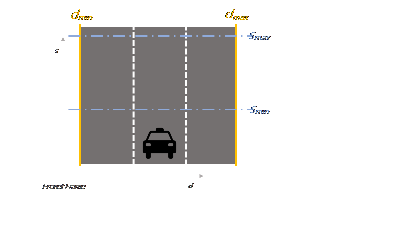
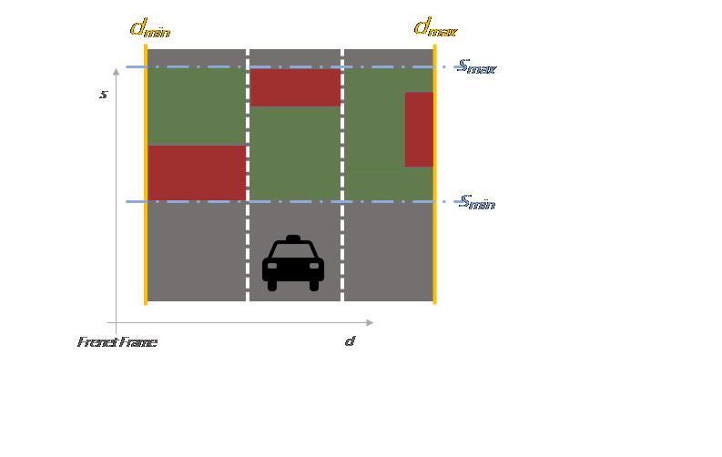
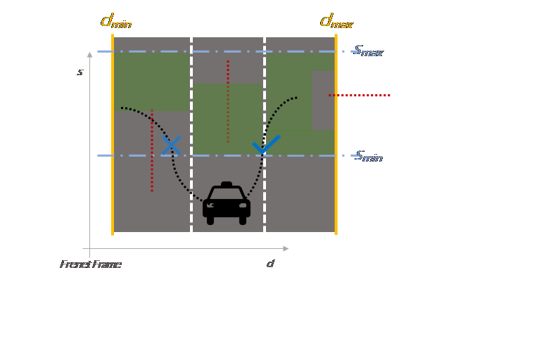

# Trajectory Planning for Highway Scenario Using Classic Robotics Approach

---


The goals of this project are the following:
* Pilot the ego vehicle along the simulated highway for **at least one round (4.32 miles) without incidents**. 

The detailed definition of incidents are as below:
* _Obey Speed Limit_
    * The car doesn't drive faster than the speed limit **(50 MPH)**. 
    * Also the car isn't driving much slower than speed limit unless obstructed by traffic.
* _Not Exceeded Max Acceleration & Jerk_
    * The car does not exceed a total acceleration of **10 m/s^2** and a jerk of **10 m/s^3**.
* _No Collision_
    * The car must not come into contact with any of the other cars on the road.
* _Keep Lane_
    * The car doesn't spend more than a 3 second length out side the lanes during lane changing.
    * Every other time the car stays inside one of the 3 lanes on the right hand side of the road.
* _Change Lane_
    * The car is able to smoothly change lanes when it makes sense to do so, such as:
        * Behind a slower moving car
        * An adjacent lane is clear of other traffic.

---

## Performance Evaluation

### 1. The Car is Able to Keep Lane


### 2. The Car is Able to Change Lane


### 3. The Car is Able to Follow Leading Vehicle Without Collision


---

## Environment Setup

### 0. Dependencies

* cmake >= 3.5
  * All OSes: [click here for installation instructions](https://cmake.org/install/)
* make >= 4.1
  * Linux: make is installed by default on most Linux distros
  * Mac: [install Xcode command line tools to get make](https://developer.apple.com/xcode/features/)
  * Windows: [Click here for installation instructions](http://gnuwin32.sourceforge.net/packages/make.htm)
* gcc/g++ >= 5.4
  * Linux: gcc / g++ is installed by default on most Linux distros
  * Mac: same deal as make - [install Xcode command line tools]((https://developer.apple.com/xcode/features/)
  * Windows: recommend using [MinGW](http://www.mingw.org/)
* [uWebSockets](https://github.com/uWebSockets/uWebSockets)
  * Run either `install-mac.sh` or `install-ubuntu.sh`.
  * If you install from source, checkout to commit `e94b6e1`, i.e.
    ```
    git clone https://github.com/uWebSockets/uWebSockets 
    cd uWebSockets
    git checkout e94b6e1
    ```

### 1. Download Simulator.
You can download the simulator for testing highway scenario from [releases tab (https://github.com/udacity/self-driving-car-sim/releases/tag/T3_v1.2).

### 2. How to Enjoy

1. Clone this repo.
2. Make a build directory: `mkdir build && cd build`
3. Compile: `cmake .. && make`
4. Run it: `./path_planning`.

---

## System Cookbook

### 1. Map

1. Location: `data/udacity-map-original.csv`
2. Schema
    * _s_ the distance along the center line to get to that waypoint in meters
    * _x_ & _y_ the waypoint's map coordinate position
    * _dx_ & _dy_ the unit normal vector pointing outward of the highway loop.

**Note**
    The highway's waypoints loop around so the frenet s value, distance along the road, goes from 0 to 6945.554.

### 2. Ego Vehicle

1. ["x"] The car's x position in map coordinates
2. ["y"] The car's y position in map coordinates
3. ["s"] The car's s position in frenet coordinates
4. ["d"] The car's d position in frenet coordinates
5. ["yaw"] The car's yaw angle in the map
6. ["speed"] The car's speed in MPH

### 3. Previous Path's End s & d values 

1. ["end_path_s"] The previous list's last point's frenet s value
2. ["end_path_d"] The previous list's last point's frenet d value

### 4. Previous Path Given to Actuator

1. ["previous_path_x"] The previous list of x points previously given to the simulator
2. ["previous_path_y"] The previous list of y points previously given to the simulator

**Note**
    Return the previous list but with processed points removed, can be a nice tool to show how far along the path has processed since last time. 

### 5. Sensor Fusion , a list of all other car's attributes on the same side of the road. (No Noise)

1. ["sensor_fusion"] 
    * A 2d vector of cars and then that car's:
        * car's unique ID
        * car's x position in map coordinates
        * car's y position in map coordinates
        * car's x velocity in m/s
        * car's y velocity in m/s
        * car's s position in frenet coordinates
        * car's d position in frenet coordinates. 

---

## System Details

1. The car uses a perfect controller and will visit every (x,y) point it recieves in the list every .02 seconds. The units for the (x,y) points are in meters and the spacing of the points determines the speed of the car. The vector going from a point to the next point in the list dictates the angle of the car. Acceleration both in the tangential and normal directions is measured along with the jerk, the rate of change of total Acceleration. The (x,y) point paths that the planner recieves should not have a total acceleration that goes over 10 m/s^2, also the jerk should not go over 50 m/s^3. (NOTE: As this is BETA, these requirements might change. Also currently jerk is over a .02 second interval, it would probably be better to average total acceleration over 1 second and measure jerk from that.

2. There will be some latency between the simulator running and the path planner returning a path, with optimized code usually its not very long maybe just 1-3 time steps. During this delay the simulator will continue using points that it was last given, because of this its a good idea to store the last points you have used so you can have a smooth transition. previous_path_x, and previous_path_y can be helpful for this transition since they show the last points given to the simulator controller with the processed points already removed. You would either return a path that extends this previous path or make sure to create a new path that has a smooth transition with this last path.

---

## Solution Overview

### Architecture


Current solution architecture is organized as follows:

    * High-Definition Map: Provide map info of driving scenario
    * Localization: Provide ego vehicle's localization and odometry
    * Prediction: Predict surrouding objects' short-term motion
    * Path Planner: Generate feasible & optimal trajectory for ego vehicle's next step motion
    * Driving Strategy: Evaluate next step motion's feasibility and optimality
    * Trajectory Generator: Generate trajectory for next step motion
    * Actuator: Interface to simulator

### High-Definition Map

<a href="src/map">High-Definition Map</a> is a class as both map reader, writer and center line smoother.

* Map Reader & Writer
    * Use <a href="src/utils/csv">CSV library</a> for convenient map loading.
    * Save the processed map(e.g, the one attained through resolution improvement) as CSV.

* Center Line Smoother
    * Use <a href="src/utils/spline">spline library</a> to generate smooth center line between original map waypoints

### Localization

<a href="src/vehicle">Localization</a> is a convenient wrapper for ego vehicle's state and odometry.

* Ego Vehicle State
    * Convenient access to ego vehicle's world frame & frenet frame position, heading and speed

* Odometry
    * Access to previous planned trajectory.
    * Estimate next actuation time for next step motion planning.

* Start Configuration Estimation
    * Estimate start configuration for next step motion planning.

### Prediction

<a href="src/prediction">Prediction</a> predicts surrounding objects's short-term motion.

* Maneuvers Implemented
    * Follow Lane: Surrounding objects would follow current lane at current speed for the whole horizon.
    * Drive Freespace: Surrounding objects would keep current speed and heading and drive as if in freespace, ignore lane totally.

### Path Planner

<a href="src/planning/planner.cpp">Path Planner</a> generates both feasible and optimal trajectory for ego vehicle's next step motion. It follows the methodology proposed in this paper <a href="https://pdfs.semanticscholar.org/0e4c/282471fda509e8ec3edd555e32759fedf4d7.pdf">Optimal Trajectory Generation for Dynamic Street Scenarios in a Frenet Frame</a>

* Feasible Zone Generator
    * Generate feasible zone, end configuration space in adjacent alnes, using ego vehicle's current state and surrouding object prediction.

* Trajectory Generation and Evaluation
    * Given feasible zone, propose end configurations.
    * Solve jerk minimized trajectory using selected start & end configuration.
    * Evaluate the feasibility and optimality of proposed trajectory.

### Driving Strategy

<a href="src/planning/driving_strategy.cpp">Driving Strategy</a> evaluates the feasibility and optimality of proposed trajectory

* Feasibility--Satisfy Max Speed, Acceleration and Jerk
    * Check for Parametric Trajectory
        * Given the parametric form of proposed trajectory(coefficients of the quintic polynomial), evaluate its 1st, 2nd and 3rd order derivatives at each future timestamp at the interval of 0.02 seconds.
    * Check for Numerical Trajectory
        * Given the proposed trajectory in C++ vector format, evaluate its 1st, 2nd and 3rd order numerical derivatives using second order forward difference formula at each evaluatable timestamp.

* Optimality--Evaluate from Efficiency, Flexibility and Safety
    * Efficiency
        * Feasible distance covered
        * Feasible speed reached
        * Lane change cost
    * Flexibity
        * Is leading or following vehicle presents
        * Available are in lane
        * Possbile future maneuvers of selected lane
    * Safety
        * Safety distance needed for emergency case handling.

### Trajectory Generator

<a href="src/planning/trajectory_generator.cpp">Trajectory Generator</a> propose trajectory for next step motion and optimize final trajectory through spline smoothing of previous and newly generated trajectory.

* Trajectory Proposal
    * Solve the coefficients of the quintic polynomial for both S and D trajectory using the method in courseware

* Trajectory Optimization
    * Smooth the final trajectory using previously executed waypoints and newly generated waypoints through spline smoothing

---

## Notes on Motion Planning

### 1. Ego Vehicle Feasible Zone Generation



### 2. Surrounding Object Prediction


### 3. End Configuration Generation



### 4. Trajectory Generation and Evaluation



---

## Next Step Plan

### Fine Tune Cost Functions in Driving Strategy Module

Current cost function only has a very high probability of completing the round trip with no incidents. It has a high probability to cause incidents in dense traffic situations due to frequent failure of trajectory planning. Fine tuning is still needed to guarantee its performance.

### Evaluate New Methods for Planning

Current cost function is based on human heuristics and manual fine tuning of hyper-parameters. This is an extremely painful job. Next step plan would be bring ideas from Robotics Software Engineer Term 2 such as deep reinforcement learning based approaches to better solve this planning problem.

---

## Further Readings

<a href="https://robotics.stackexchange.com/questions/8302/what-is-the-difference-between-path-planning-and-motion-planning">1. What is the Difference between Path Planning and Motion Planning</a>

<a href="http://correll.cs.colorado.edu/?p=965">2.a Introduction to Path Planning</a>

<a href="http://ais.informatik.uni-freiburg.de/teaching/ss10/robotics/slides/16-pathplanning.pdf">2.b Path Planning and Collision Avoidance</a>

<a href="http://ais.informatik.uni-freiburg.de/teaching/ss11/robotics/slides/18-robot-motion-planning.pdf">3.a Robot Motion Planning</a>